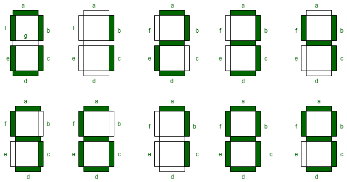

# Seven Segment Equation Solver

Given an incorrect mathematical equation of the form x = y, move a single segment in the seven-segment representation of x = y to correct the equation.
Constraints:
- The input is a string equation of the form "x = y".
- The expected output is the corrected string equation in the same format.
- x and y can consist of multiple terms.
- The only operations allowed are '+' and '-'.
- The equation is solvable by moving a single segment.
- Horizontal segments can become vertical segments, and vice-versa.

## Seven-Segment Representation
Each digit from 0-9, the addition sign, and the negative sign can be represented as a seven-segment display value.

The addition sign can be represented as a vertical and horizontal segment, the subtraction sign as a single horizontal segment, and the equals sign as a pair of horizontal segments.